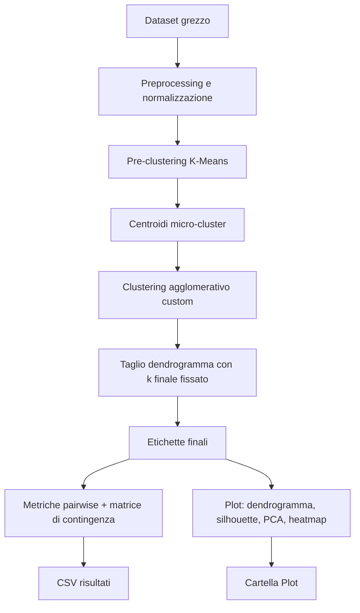

# Hierarchical Clustering Ibrido (K-Means + Agglomerativo)

Relazione tecnica del progetto di clustering non supervisionato con pipeline ibrida.

Il repository implementa un approccio a due stadi:

  - pre-clustering con K-Means per ridurre la cardinalità del dataset;
  - clustering gerarchico agglomerativo custom sui centroidi ottenuti.

Obiettivo: rendere trattabili e leggibili dataset estesi (in particolare Anuran Calls / Frogs MFCCs), mantenendo un output interpretabile tramite dendrogramma, silhouette e metriche di coerenza dei cluster.

## 1\. Obiettivi del lavoro

Gli obiettivi principali sono:

  - implementare da zero il clustering agglomerativo con più strategie di linkage;
  - integrare un pre-processing K-Means per ridurre complessità computazionale;
  - confrontare configurazioni diverse di linkage e riduzione K-Means;
  - salvare risultati quantitativi e grafici per analisi sperimentale.

## 2\. Cenni teorici

### 2.1 Clustering agglomerativo

Nel clustering gerarchico agglomerativo ogni osservazione parte come cluster singolo. A ogni iterazione vengono uniti i due cluster più vicini fino a ottenere un solo cluster (o un numero fissato tramite taglio del dendrogramma).

### 2.2 Distanza tra cluster: idea generale

Il punto chiave non è solo la distanza tra singoli punti, ma la distanza tra *insiemi* (cluster).
Data una metrica di base $d(x_i, x_j)$, il linkage definisce una funzione $D(A, B)$ tra cluster $A$ e $B$.

Nel progetto la metrica base usata nelle run principali è euclidea.

### 2.3 Differenze tra i linkage analizzati

Di seguito le varianti usate nelle analisi:

1.  **Single linkage**

      - Definizione: $$D(A,B)=\min_{x\in A, y\in B} d(x,y)$$
      - Effetto tipico: tende a creare catene (chaining), sensibile a punti ponte.

2.  **Complete linkage**

      - Definizione: $$D(A,B)=\max_{x\in A, y\in B} d(x,y)$$
      - Effetto tipico: cluster più compatti, maggiore separazione, più sensibile agli outlier lontani.

3.  **Average linkage**

      - Definizione: $$D(A,B)=\frac{1}{|A||B|}\sum_{x\in A}\sum_{y\in B} d(x,y)$$
      - Effetto tipico: compromesso tra single e complete, spesso più stabile.

4.  **Centroid linkage**

      - Definizione: $$D(A,B)=\|\mu_A-\mu_B\|_2$$
      - con $\mu_A, \mu_B$ centroidi dei cluster.
      - Effetto tipico: favorisce unioni guidate dalla posizione media; può avere comportamenti diversi in presenza di cluster allungati.

5.  **Ward linkage**

      - Definizione (incremento di varianza intra-cluster):
        $$D(A,B)=\frac{|A||B|}{|A|+|B|}\|\mu_A-\mu_B\|_2^2$$
      - Effetto tipico: tende a produrre cluster compatti e bilanciati minimizzando l'aumento della somma dei quadrati intra-cluster.

## 3\. Pipeline ibrida del progetto

1.  Caricamento dataset e preprocessing (normalizzazione e opzioni di riduzione feature).
2.  Pre-clustering K-Means con un numero $k$ configurabile (`k_means_reduction`).
3.  Clustering gerarchico agglomerativo custom sui centroidi K-Means.
4.  Taglio del dendrogramma con numero di cluster finale impostato manualmente (`optimal_k`).
5.  Salvataggio di:
      - metriche in CSV;
      - dendrogrammi;
      - silhouette plot.

Rappresentazione della pipeline:



## 4\. Scelta dei Parametri in Ambito Non Supervisionato

In assenza di una *ground truth* nota (es. un dataset sul vino senza classi), la giustificazione dei parametri dell'algoritmo non può basarsi su metriche esterne come Precision o Recall, ma deve affidarsi alla struttura intrinseca dei dati e a metriche di validazione interna.

### 4.1 Numero di micro-cluster per il pre-processing ($k$)

Nel nostro approccio ibrido, il K-Means non ha lo scopo di trovare i cluster finali, ma di generare dei "micro-cluster" (o prototipi) che sintetizzino la distribuzione dei dati originali, abbattendo i tempi di calcolo dell'agglomerativo. Come si giustifica il valore di $k$?

  * **Regola pratica (Rule of Thumb):** Il parametro $k$ deve essere sufficientemente piccolo da garantire un vantaggio computazionale, ma molto più grande del numero atteso di cluster finali. Una regola empirica diffusa suggerisce $k \approx \sqrt{N/2}$, dove $N$ è il numero di campioni totali.
  * **Stabilità delle metriche:** Si può giustificare un valore di $k$ dimostrando empiricamente che la sua variazione non degrada la qualità finale. Se calcolando la Silhouette finale passando da $k=100$ a $k=50$ il punteggio resta stabile, significa che 50 micro-cluster sono sufficienti a mantenere inalterata la topologia originale del dataset senza perdita di informazione critica.

### 4.2 Determinazione del numero di cluster finali ("a priori")

Nel flusso operativo corrente, il numero di cluster finali viene imposto manualmente (`optimal_k`) per mantenere il comportamento semplice, riproducibile e controllabile.

  * **Scelta guidata dalla ground truth (analisi supervisionata ex-post):** per il dataset Frogs si imposta `optimal_k=4`.
  * **Analisi manuale post-run:** eventuali alternative vengono valutate a mano con confronto di metriche, dendrogramma e contingenza, senza automatismi interni.

## 5\. Matrice di Confusione: Contingenza vs Pairwise

Nel progetto convivono due viste diverse:

1. **Matrice di contingenza (multiclasse)**
    - classi reali sulle righe e cluster predetti sulle colonne
    - utile per capire "quale classe finisce in quale cluster"
    - nel caso Frogs (4 famiglie) si ottiene una matrice 4xK

2. **Valutazione pairwise (2x2 virtuale)**
    - TP/FP/TN/FN vengono calcolati sulle coppie di campioni
    - questa e la base delle metriche pairwise (incluso il Rand Index)
    - formula usata: $RI = \frac{TP + TN}{TP + FP + FN + TN}$

Quindi i valori TP/FP/TN/FN nei CSV non sono in conflitto con il fatto di avere piu classi: sono il risultato della valutazione sulle coppie, non una confusion matrix multiclasse classica.

## 6\. Visualizzazione Qualitativa dei Cluster

Poiche i dataset sono ad alta dimensionalita, non e possibile plottare direttamente lo spazio originale. La pipeline include due visualizzazioni leggere:

1. **Proiezione PCA 2D dei campioni colorati per cluster predetto**
2. **Heatmap di contingenza (classe vera vs cluster predetto)**

Questi plot si attivano da CLI con:

  ```bash
  --plot-cluster-views
  ```

Se attivo, vengono salvati entrambi i plot per ogni run; se disattivo, non vengono generati.

## 7\. Struttura del progetto

  - `main.py`: entrypoint CLI con argparse.
  - `src/funzioni.py`: orchestrazione della pipeline e utility operative.
  - `src/hierarchical_clustering.py`: implementazione custom dell'agglomerativo.
  - `src/data.py`: caricamento/preprocessing dataset.
  - `src/evaluation.py`: metriche e selezione cluster.
  - `src/plot.py`: generazione grafici.
  - `assets/Dataset/`: dataset sorgente.
  - `assets/<dataset>/Results/`: risultati numerici.
  - `assets/<dataset>/Plot/`: grafici.

## 8\. Esecuzione

Setup ambiente:

```bash
uv venv
source .venv/bin/activate
uv pip install numpy pandas scipy scikit-learn matplotlib ucimlrepo
```

Help completo CLI:

```bash
uv run main.py --help
```

Esempio run singola:

```bash
uv run main.py --mode single --dataset Frogs_MFCCs --linkage ward --distance euclidean --kmeans-reduction 60 --optimal-k 4
```

Esempio run singola con plot qualitativi:

```bash
uv run main.py --mode single --dataset Frogs_MFCCs --linkage ward --distance euclidean --kmeans-reduction 60 --optimal-k 4 --plot-cluster-views
```

Esempio run multipla:

```bash
uv run main.py --mode multi --dataset Frogs_MFCCs --k-min auto --k-max auto --auto-window 8 --optimal-k 4 --no-plot-cluster-views
```

## 9\. Caso di Studio e Risultati: Dataset Frogs MFCCs

Per validare la robustezza della pipeline ibrida, il modello e stato testato sul dataset **Anuran Calls (Frogs MFCCs)**, composto da 7195 campioni audio raggruppabili in 4 famiglie principali.

Applicando la regola empirica $k \approx \sqrt{N/2}$, e stato scelto `k_means_reduction=60`, riducendo in modo significativo il costo computazionale del clustering gerarchico e mantenendo prototipi informativi.

Durante l'analisi e emersa una forte dipendenza dei risultati dalla scelta del criterio di linkage.

### 9.1 Sensibilita agli outlier: Complete Linkage

Con distanza euclidea e **Complete Linkage**, il modello tende a isolare micro-cluster compatti (comportamento utile per anomaly detection), ma nel task di partizionamento in 4 famiglie questo puo aumentare la frammentazione e ridurre il recall complessivo.

<div align="center" style="margin-top: 10px; margin-bottom: 10px;">
  
  
</div>

<div align="center" style="margin-top: 10px; margin-bottom: 20px;">
  
</div>

### 9.2 Bilanciamento geometrico: Ward Linkage

Con **Ward Linkage**, minimizzando l'incremento di varianza intra-cluster a ogni fusione, il partizionamento risulta piu bilanciato: silhouette piu regolare, macro-aree PCA piu proporzionate e migliore stabilita esplorativa sulle 4 famiglie.

Questa e la configurazione finale raccomandata nel progetto.

<div align="center" style="margin-top: 10px; margin-bottom: 10px;">
  
  
</div>

<div align="center" style="margin-top: 10px; margin-bottom: 20px;">
  
</div>

### 9.3 Note implementative: confronto Custom vs Scikit-learn

Nelle run con linkage `single`, `complete` e `average`, le metriche pairwise della versione custom risultano sovrapponibili alla baseline scikit-learn nelle configurazioni testate.

Con `ward`, possono comparire differenze molto piccole dovute a floating-point e tie-breaking: implementazioni diverse (Python puro vs C/Cython) possono scegliere fusioni iniziali lievemente differenti a parita numerica, producendo dendrogrammi non identici ma qualitativamente allineati.

<div align="center" style="margin-top: 10px; margin-bottom: 10px;">
  
  
  
</div>

<div align="center">
  
</div>

La lettura consigliata è:

  - confrontare prima metriche aggregate (precision/recall/F1/rand index);
  - poi verificare coerenza del taglio con silhouette e dendrogramma;
  - infine usare `linkage=ward` come configurazione finale per il caso Frogs.

